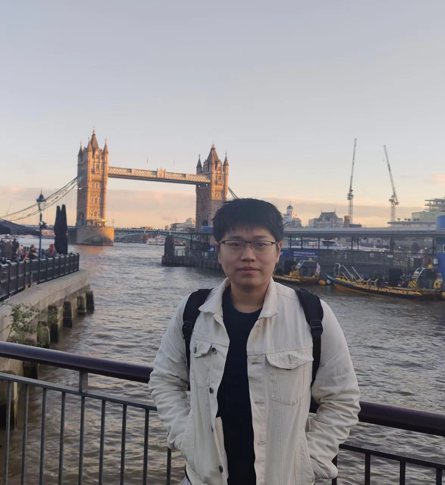
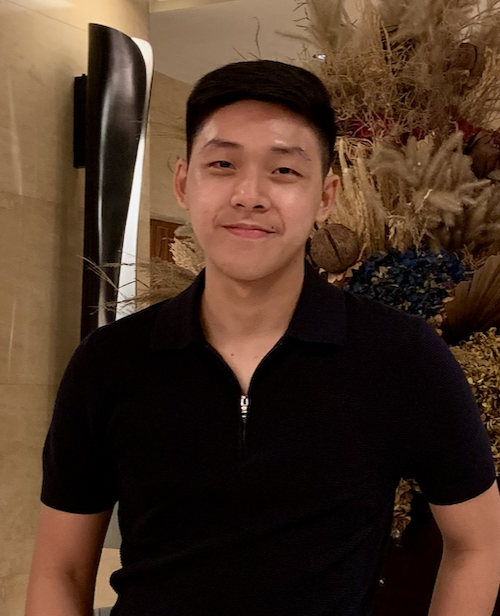
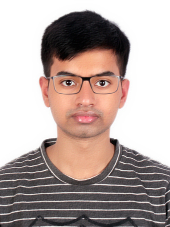

# About Us

We are a team based in the [School of Computing, National University of Singapore](http://www.comp.nus.edu.sg).

You can reach us at the email `seer[at]comp.nus.edu.sg`

## Project team

### John Doe

[[homepage](http://www.comp.nus.edu.sg/~damithch)]
[[github](https://github.com/johndoe)]
[[portfolio](team/johndoe.md)]

* Role: Project Advisor

### Li Siqi

[[github](http://github.com/siqirua)]
[[portfolio](team/siqirua.md)]

* Role: Developer
* Responsibilities: Data

### Mario Alvaro

[[github](http://github.com/marioalvaro)] [[portfolio](team/marioalvaro.md)]

* Role: Developer
* Responsibilities: Data

### Yufei Sun

[[github](http://github.com/feifeiraindrops)]
[[portfolio](team/feifeiraindrops.md)]

* Role: Developer
* Responsibilities: Dev Ops + Threading

### Vedant Sinha

[[github](https://github.com/SinhaVedant)]
[[portfolio](team/sinhavedant.md)]

* Role: Testing
* Responsibilities: UI
