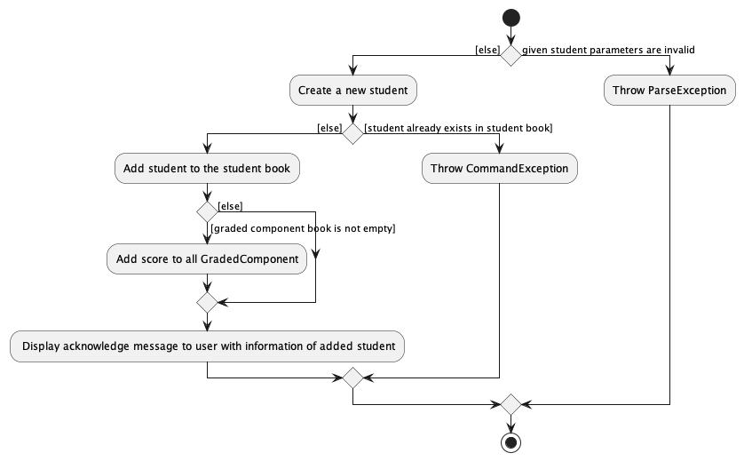
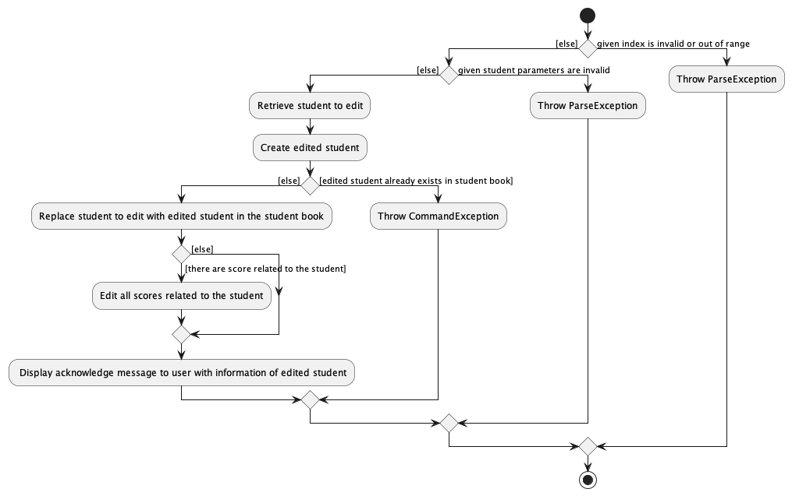
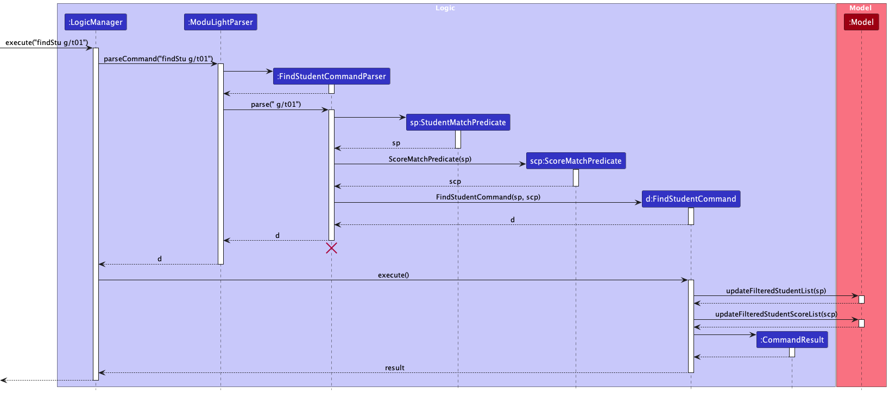

# ModuLight Developer Guide

--------------------------------------------------------------------------------------------------------------------
* Table of Contents
    * **[Acknowledgements](#acknowledgements)**
    * **[Setting up, getting started](#setting-up-getting-started)**
    * **[Design](#design)**
    * **[Implementation](#implementation)**
    * **[Others](#documentation-logging-testing-configuration-dev-ops)**
    * **[Appendix: Requirements](#appendix-requirements)**
    * **[Appendix: Instructions for manual testing](#appendix-instructions-for-manual-testing)**
    * **[Appendix: Planned enhancements](#appendix-planned-enhancements)**

--------------------------------------------------------------------------------------------------------------------

## **Acknowledgements**

* [AddressBook-3](https://github.com/nus-cs2103-AY2223S1/tp)

--------------------------------------------------------------------------------------------------------------------

## **Setting up, getting started**

Refer to the guide [_Setting up and getting started_](SettingUp.md).

--------------------------------------------------------------------------------------------------------------------

## **Design**

### Architecture

<puml src="diagrams/ArchitectureDiagram.puml" width="280" />

The ***Architecture Diagram*** given above explains the high-level design of the App.

Given below is a quick overview of main components and how they interact with each other.

**Main components of the architecture**

**`Main`** (consisting of classes [`Main`](https://github.com/se-edu/addressbook-level3/tree/master/src/main/java/seedu/address/Main.java) and [`MainApp`](https://github.com/se-edu/addressbook-level3/tree/master/src/main/java/seedu/address/MainApp.java)) is in charge of the app launch and shut down.
* At app launch, it initializes the other components in the correct sequence, and connects them up with each other.
* At shut down, it shuts down the other components and invokes cleanup methods where necessary.

The bulk of the app's work is done by the following four components:

* [**`UI`**](#ui-component): The UI of the App.
* [**`Logic`**](#logic-component): The command executor.
* [**`Model`**](#model-component): Holds the data of the App in memory.
* [**`Storage`**](#storage-component): Reads data from, and writes data to, the hard disk.

[**`Commons`**](#common-classes) represents a collection of classes used by multiple other components.

**How the architecture components interact with each other**

The *Sequence Diagram* below shows how the components interact with each other for the scenario where the user issues the command `delete 1`.

<puml src="diagrams/ArchitectureSequenceDiagram.puml" width="574" />

Each of the four main components (also shown in the diagram above),

* defines its *API* in an `interface` with the same name as the Component.
* implements its functionality using a concrete `{Component Name}Manager` class (which follows the corresponding API `interface` mentioned in the previous point).

For example, the `Logic` component defines its API in the `Logic.java` interface and implements its functionality using the `LogicManager.java` class which follows the `Logic` interface. Other components interact with a given component through its interface rather than the concrete class (reason: to prevent outside component's being coupled to the implementation of a component), as illustrated in the (partial) class diagram below.

<puml src="diagrams/ComponentManagers.puml" width="300" />

The sections below give more details of each component.

### UI component

The **API** of this component is specified in [`Ui.java`](https://github.com/AY2324S1-CS2103T-W08-2/tp/blob/master/src/main/java/seedu/address/ui/Ui.java)

<puml src="diagrams/UiClassDiagram.puml" alt="Structure of the UI Component"/>

The UI consists of a `MainWindow` that is made up of parts e.g.`CommandBox`, `ResultDisplay`, `StudentListPanel`,
`GradedComponentListPanel`, `StudentScoreListPanel`, `StatusBarFooter` etc. All these, including the `MainWindow`, inherit from the abstract `UiPart` class which captures the commonalities between classes that represent parts of the visible GUI.

The `UI` component uses the JavaFx UI framework. The layout of these UI parts are defined in matching `.fxml` files that are in the `src/main/resources/view` folder. For example, the layout of the [`MainWindow`](https://github.com/se-edu/addressbook-level3/tree/master/src/main/java/seedu/address/ui/MainWindow.java) is specified in [`MainWindow.fxml`](https://github.com/se-edu/addressbook-level3/tree/master/src/main/resources/view/MainWindow.fxml)

The `UI` component,

* executes user commands using the `Logic` component.
* listens for changes to `Model` data so that the UI can be updated with the modified data.
* keeps a reference to the `Logic` component, because the `UI` relies on the `Logic` to execute commands.
* depends on some classes in the `Model` component, as it displays `Student`, `GradedComponent` and `StudentScore`objects residing in the `Model`.

### Logic component

**API** : [`Logic.java`](https://github.com/se-edu/addressbook-level3/tree/master/src/main/java/seedu/address/logic/Logic.java)

Here's a (partial) class diagram of the `Logic` component:

<puml src="diagrams/LogicClassDiagram.puml" width="550"/>

The sequence diagram below illustrates the interactions within the `Logic` component, taking `execute("deleteStu 1")` API call as an example.

<puml src="diagrams/DeleteSequenceDiagram.puml" alt="Interactions Inside the Logic Component for the `delete 1` Command" />

<box type="info" seamless>

**Note:** The lifeline for `DeleteCommandParser` should end at the destroy marker (X) but due to a limitation of PlantUML, the lifeline reaches the end of diagram.
</box>

How the `Logic` component works:

1. When `Logic` is called upon to execute a command, it is passed to an `ModuLightParser` object which in turn creates a parser that matches the command (e.g., `DeleteStudentCommandParser`) and uses it to parse the command.
2. This results in a `Command` object (more precisely, an object of one of its subclasses e.g., `DeleteStudentCommand`) which is executed by the `LogicManager`.
3. The command can communicate with the `Model` when it is executed (e.g. to delete a student).
4. The result of the command execution is encapsulated as a `CommandResult` object which is returned back from `Logic`.

**Note:** There are three different model objects, namely the StudentBook, the StudentScoreBook and the GradedComponentBook.
The command might interact with one or more model objects. For example, when a student is deleted, the command will communicate 
with the StudentBook to delete this student, as well as the StudentScoreBook, to delete all the student scores relevant to this student.

Here are the other classes in `Logic` (omitted from the class diagram above) that are used for parsing a user command:

<puml src="diagrams/ParserClasses.puml" width="600"/>

How the parsing works:
* When called upon to parse a user command, the `ModuLightParser` class creates an `XYZCommandParser` (`XYZ` is a placeholder for the specific command name e.g., `AddCommandParser`) which uses the other classes shown above to parse the user command and create a `XYZCommand` object (e.g., `AddCommand`) which the `ModuLightParser` returns back as a `Command` object.
* All `XYZCommandParser` classes (e.g., `AddStudentCommandParser`, `DeleteStudentCommandParser`, ...) inherit from the `Parser` interface so that they can be treated similarly where possible e.g, during testing.

### Model component
**API** : [`Model.java`](https://github.com/se-edu/addressbook-level3/tree/master/src/main/java/seedu/address/model/Model.java)

<puml src="diagrams/ModelClassDiagram.puml" width="600" />

Note that Student, StudentGrade and GradeComponent classes have similar structures and dependencies, thus, we use Ssc class to represent these three and their related classes in the class diagram above.

Here are the class diagrams for Ssc (Student, StudentGrade, GradedComponent) classes respectively.
<puml src="diagrams/StudentModelDiagram.puml" width="450" />  
<puml src="diagrams/StudentScoreModelDiagram.puml" width="300" />
<puml src="diagrams/GradedComponentModelDiagram.puml" width="300" />

The `Model` component,

* stores the ModuLight data i.e., all `Student` objects (which are contained in a `UniqueStudentList` object), all `StudentScore` objects (which are contained in a `UniqueStudentScoreList` object) and all `GradedComponent` objects (which are contained in a `UniqueGradedComponentList` object).
* stores the currently 'selected' `Student`, `StudentScore` and `GradedComponent` objects (e.g., results of a search query) as separate _filtered_ lists respectively which are exposed to outsiders as unmodifiable `ObservableList<Student>`, `ObservableList<StudentScore>` and `ObservableList<GradedComponent>` that can be 'observed' e.g. the UI can be bound to this list so that the UI automatically updates when the data in the list change.
* stores a `UserPref` object that represents the user’s preferences. This is exposed to the outside as a `ReadOnlyUserPref` objects.
* does not depend on any of the other three components (as the `Model` represents data entities of the domain, they should make sense on their own without depending on other components)

<box type="info" seamless>

**Note:** For student and student score, an alternative (arguably, a more OOP) model is given below. It has a `Tag` list in the `Student`, which `Student` references. This allows `AddressBook` to only require one `Tag` object per unique tag, instead of each `Person` needing their own `Tag` objects. 

<puml src="diagrams/BetterModelClassDiagram.puml" width="450" />

</box>

### Storage component

**API** : [`Storage.java`](https://github.com/se-edu/addressbook-level3/tree/master/src/main/java/seedu/address/storage/Storage.java)

<puml src="diagrams/StorageClassDiagram.puml" />

Here are the complete class diagrams of StudentBook Storage, StudentScoreBook Storage and GradedComponentBook Storage.

<puml src="diagrams/StudentAndScoreBookStorage.puml" />

<puml src="diagrams/GradedComponentBookStorage.puml" />

The `Storage` component,
* can save student data, student score data, graded component data and user preference data in JSON format, and read 
  them back into the corresponding objects.  
* inherits from `StudentBookStorage`, `GradedComponentBookStorage`, `StudentScoreBookStorage` and `UserPrefsStorage`, which means it can be treated as any of the one (if only the functionality of only one is needed).
* depends on some classes in the `Model` component (because the `Storage` component's job is to save/retrieve objects that belong to the `Model`)

### Common classes

Classes used by multiple components are in the `seedu.modulight.commons` package.

--------------------------------------------------------------------------------------------------------------------

## **Implementation**

This section describes some noteworthy details on how certain features are implemented.

### Add Student
The `addStu` function allows the user to add a new student to the database. ModuLight maintains a `UniqueStudentList` 
to make sure that there is no duplicates. 
The new `Student` object will be added to the `StudentBook`. An empty `StudentScore` related to this `Student` will be added to all existing `GradedComponent`.

The student can only be added if the user entered valid inputs for its name, student id, email, tutorial group(optional) and tag(optional). A default `TutorialGroup` with value T00 will be assigned to the student if the user did not assign the student to a tutorial group.

The following activity diagram illustrates the process of execution of an `AddStudentCommand`.

### Edit Student
The `editStu` function allows the user to edit the information of the student indicated by index. 
The previous `Student` object will be removed from the `StudentBook`. A new student object with the edited information will be added to the database. 
All student scores related to this `Student` will be updated as well.

The student can only be edited if the user entered valid inputs for its name, student id, email, tutorial group(optional) and tag(optional). 

The following activity diagram illustrates the process of execution of an `EditStudentCommand`.

### Find Student
The `findStu` function allows the user to find the student that matches the given search criteria.

It displays both the matching students and relevant student scores that belongs to the student.
All graded components are displayed since they are considered relevant to the student.

To find the wanted student, a `StudentMatchPredicate` is created to test whether a student matches the search keywords. A `ScoreMatchPredicate` is created from the `StudentMatchPredicate` to test whether the score belongs to the matched student.

This only changes the displayed list of students and student scores, stored as `filteredStudentList` and `filteredStudentScoreList` in `Model`, without affecting the data stored in ModuLight.

The following sequence diagram illustrates the process of execution of an `FindStudentCommand`.

### Sort Commands

The Sort related features allows NUS professors to sort the currently displayed students or student scores. When successfully executed, the sorted students or student scores will be shown on the Graphical User Interface.  

We will discuss the implementation of `sortScore` (Sort Student Scores) command here and omit the discussion of the implementation of `sortStu` command since it is very similar to `sortScore` command and simpler.

#### Implementation

The `sortScore` mechanism is facilitated by GradedComponentBook, StudentBook and StudentScoreBook. It implements the following operations:

* `GradedComponentBook#hasGc(GcName gcName)` - Returns true if a graded component is already created and in the graded component list.
* `studentScoreBook.sortStudentScore(Boolean isReverse)` - Filters the student scores with the given graded component and sort them according to the given reverse order.
* `studentBook.sortStudentScore(GcName gcName, Boolean isReverse)` - Sorts students by their scores in a given graded component.

Given below is an example usage scenario and how the `sortScore` mechanism behaves at each step.

Step 1. The GUI displayed the list of students and their student scores that the user wants to sort after some `find` or `list` commands.

Step 2. The user executes `sortStuScore c/Midterm` command to sort the current displayed lists of students and student scores. The `sortStuScore` command calls SortStudentScoreCommandParser#parse() which parses the string keyed into the command line of the GUI.

Step 3. `SortStudentScoreCommandParser#parse()` invokes the creation of a `SortStudentScoreCommand` object.
> **Note**: If a command fails its execution due to incorrect command format, it will not create a `SortStudentScoreCommand` object, an error message will be displayed and user will retype their command.

Step 4. Upon creation and execution of `SortStudentScoreCommand` object, `GradedComponentBook#hasGc(GcName gcName)`, `studentScoreBook.sortStudentScore(Boolean isReverse)` and `studentBook.sortStudentScore(GcName gcName, Boolean isReverse)` methods are called.
> **Note**: If upon invoking `GradedComponentBook#hasGc(GcName gcName)` method and return value is false, it will throw an error and will not call the remaining two methods, so the students and student scores will not be sorted.

Step 5. After successfully sorting student scores and their associated students, a `CommandResult` object will be created to tell the user that the student scores has been successfully sorted.

The following sequence diagram shows how the sort student scores operation works: 

<puml src="diagrams/SortScoreCommandSequenceDiagram.puml" alt="SortScoreCommandSequenceDiagram"></puml>

The following activity diagram summarizes what happens when a user executes a new `sortScore` command： 
<puml src="diagrams/SortScoreAcitivityDiagram.puml" alt="SortScoreActivityDiagram" />

### Stats Commands

The Stats related features allows NUS professors to calculate the statistics of student scores effectively. When successfully executed, the relevant statistics will be shown in the result display box of Graphical User Interface.  

We will discuss the implementation of `compStats` (calculate the statistics for a specific graded component) command here and omit the discussion of the implementation of `stats` command since it is very similar to `compStats` command and simpler.

#### Implementation

The `compStats` mechanism is facilitated by GradedComponentBook, StudentBook and StudentScoreBook. It implements the following operations:

* `GradedComponentBook#hasGc(GcName gcName)` - Returns true if a graded component is already created and in the graded component list.
* `studentBook.getStudentList()` - Returns the stored list of students.
* `compStatsCommand.generateOverallStatsSummary(List<Student> students)` - Returns a string represented all the relevant statistics.
* `statsCalculator` - A class that helps calculate different types of statistical measures.

Given below is an example usage scenario and how the `compStats` mechanism behaves at each step.

Step 1. The user executes `compStats c/Midterm` command to calculate the statistics of student scores of Midterm. The `compStats` command calls CompStatsCommandParser#parse() which parses the string keyed into the command line of the GUI.

Step 2. `CompStatsCommandParser#parse()` invokes the creation of a `CompStatsCommand` object.
> **Note**: If a command fails its execution due to incorrect command format, it will not create a `CompStatsCommand` object, an error message will be displayed and user will retype their command.

Step 3. Upon creation and execution of `CompStatsCommand` object, `GradedComponentBook#hasGc(GcName gcName)`, `studentBook.getStudentList()` and `compStatsCommand.generateOverallStatsSummary(List<Student> students)` methods are called.
> **Note**: If upon invoking `GradedComponentBook#hasGc(GcName gcName)` method and return value is false, it will throw an error and will not call the remaining two methods, so statistics will not be calculated and displayed.

Step 4. After successfully calculating the statistics, a `CommandResult` object will be created to show the calculated statistics.

The following sequence diagram shows how the `compStats` operation works: 

<puml src="diagrams/CompStatsCommandSequenceDiagram.puml" alt="SortScoreCommandSequenceDiagram"></puml>

The following activity diagram summarizes what happens when a user executes a new `compStats` command： 
<puml src="diagrams/CompStatsAcitivityDiagram.puml" alt="CompStatsActivityDiagram" />

### Auto-grading

#### Implementation

The auto-grading command uses the help of `EditStudentScommand` and `SortStuCommand` to properly assign each grade to the students. 
The `SortStuCommand` is used to find the grade threshold value for each grade, if the method used is by `percentile` (this will be explained later). 
Additionally, it creates clearer result as it sorts the students by their total score inversely. 
In a short manner, the mechanism works by finding the grade threshold for each grade and assigning the grade to each student by comparing
their total score to the previously found grade threshold.

There are 2 possible method of grading:
* Percentile Method: `percentile`
    * Calculate students' grade based on the statistical percentile. This will assign the grade for students above k-th percentile.
      `SortStuCommand` will be used to sort the students and find the students at the exact position of the grade threshold. 
      Note that it will **round up** the index to take a more lenient approach. The total score of that student will be used as the grade threshold.
* Absolute Score Method: `absolute`
    * Calculate students' grade based on the given passing grade values.
    * The absolute value is compared directly with the students' total score (in percentage of the maximum score possible).

**Important Note:**
* The `autoGrade` command works on the filtered student list. This would allow for example, to grade students only compared to their own tutorial group. To automatically grade every student in the module, `findStu` command can be used to display every student.

Given below is an example usage scenario and how the auto-grading mechanism for percentile calculation behaves at each step.

Step 1. The user launch the application for the first time.

Step 2. The user creates the desired graded components, adds all the students in the cohort, and assign them with scores.

Step 3. The user then executes `autoGrade ag/percentile pg/95 70 65 50 40 30 20` to execute the auto-grading system, the `percentile`
keyword indicates that ModuLight grades based on the students' percentile compared to another. The value after `pg/` indicates
the top percentile for each corresponding grade threshold, i.e. `pg/[A+] [A] [A-] [B+] ...`.

<box type="info" seamless>

**Note:** The value for `ag/` can be type `absolute` which determines the grade based on the passing score of the student's total score.

</box>

This step will first trigger the parse function and several things will be executed
1. The string argument will be parsed into the grading method and the passing value.
2. `AutoGradeCommandParser#checkAutoGradeType()` then will parse the grading method string into AutoGradeType `PERCENTILE`.
3. `AutoGradeCommandParser#mapToFloat()` will parse the passing value string into an array of float. In this step, string that is not parsable will be checked and an exception will be thrown.
   Furthermore, values less than zero or more than 100 will cause an exception to be thrown as the total mark of a student is in percentage.
   Further check on values must be decreasing is also available as lower grades cannot have higher grade threshold.
4. The parser then will return a new `AutoGradeCommand` object.

Step 4. The `AutoGradeCommand` returned will then be executed and several other things will be executed
1. This step will first trigger the `sortStuCommand` and causes the filtered student list to be updated into the sorted form. 
2. A check will be done to ensure that the inputted array of float does not pass the maximum number of values. An exception will be thrown otherwise.
3. As the grading method used in this example is `PERCENTILE`, it will then trigger `AutoGradeCommand#setGradeThresholdPercentile()` to be executed in order to calculate the
   grade threshold. 
4. It will then create an `EditStudentDescriptor` for each student in the filtered list and the assigned grade.
   The grade is determined by comparing the student's total score and the grade threshold.
5. `EditStudentCommand` will be created and executed for each student and the grade will be added.

The following sequence diagram shows how the auto-grading mechanism works:
* The parser implementation (Command execution is hidden):

<puml src="diagrams/AutoGradeParserSequenceDiagram.puml" alt="AutoGradeParserSequenceDiagram" />

* The command implementation :

<puml src="diagrams/AutoGradeCommandSequenceDiagram.puml" alt="AutoGradeCommandSequenceDiagram" />

[//]: # (The following activity diagram shows the logic behind the auto-grade mechanism:)

#### Design considerations:

**Aspect: How the assignments of grade works:**

* Create new Grade object for each student.
    * Pros: Cleaner and extendable code implementation.
    * Cons: require change of implementation on multiple classes.

### \[Proposed\] Undo/redo feature

#### Proposed Implementation

Since `Student`, `StudentGrade` and `GradedComponent` have similar dependencies and behavior, we will use `Ssc` to refer these three classes and their related classes in the following discussion. In other words, `VersionedSscBook` means `VersionedStudentBook`, `VersionedStudentScoreBook` and `VersionedGradedComponentBook`.
The proposed undo/redo mechanism is facilitated by `VersionedSscBook`. It extends `SscBook` with an undo/redo history, stored internally as an `sscStateList` and `currentStatePointer`. Additionally, it implements the following operations:

* `VersionedSscBook#commit()` — Saves the current ssc book state in its history.
* `VersionedSscBook#undo()` — Restores the previous ssc book state from its history.
* `VersionedSscBook#redo()` — Restores a previously undone ssc book state from its history.

These operations are exposed in the `Model` interface as `Model#commitSscBook()`, `Model#undoSscBook()` and `Model#redoSscBook()` respectively.

Given below is an example usage scenario and how the undo/redo mechanism behaves at each step.

Step 1. The user launches the application for the first time. The `VersionedSscBook` will be initialized with the initial Ssc book state, and the `currentStatePointer` pointing to that single Ssc book state.

<puml src="diagrams/UndoRedoState0.puml" alt="UndoRedoState0" />

Step 2. The user executes `deleteStu 5` command to delete the 5th student in the Ssc book. The `deleteStu` command calls `Model#commitSscBook()`, causing the modified state of the address book after the `delete 5` command executes to be saved in the `SscBookStateList`, and the `currentStatePointer` is shifted to the newly inserted Ssc book state.

<puml src="diagrams/UndoRedoState1.puml" alt="UndoRedoState1" />

Step 3. The user executes `addStu n/David …​` to add a new person. The `addStu` command also calls `Model#commitSscBook()`, causing another modified address book state to be saved into the `sscBookStateList`.

<puml src="diagrams/UndoRedoState2.puml" alt="UndoRedoState2" />

<box type="info" seamless>

**Note:** If a command fails its execution, it will not call `Model#commitSscBook()`, so the ssc book state will not be saved into the `sscBookStateList`.

</box>

Step 4. The user now decides that adding the student was a mistake, and decides to undo that action by executing the `undo` command. The `undo` command will call `Model#undoSscBook()`, which will shift the `currentStatePointer` once to the left, pointing it to the previous ssc book state, and restores the ssc book to that state.

<puml src="diagrams/UndoRedoState3.puml" alt="UndoRedoState3" />

<box type="info" seamless>

**Note:** If the `currentStatePointer` is at index 0, pointing to the initial SscBook state, then there are no previous SscBook states to restore. The `undo` command uses `Model#canUndoSscBook()` to check if this is the case. If so, it will return an error to the user rather
than attempting to perform the undo.

</box>

The following sequence diagram shows how the undo operation works:

<puml src="diagrams/UndoSequenceDiagram.puml" alt="UndoSequenceDiagram" />

<box type="info" seamless>

**Note:** The lifeline for `UndoCommand` should end at the destroy marker (X) but due to a limitation of PlantUML, the lifeline reaches the end of diagram.

</box>

The `redo` command does the opposite — it calls `Model#redoSscBook()`, which shifts the `currentStatePointer` once to the right, pointing to the previously undone state, and restores the ssc book to that state.

<box type="info" seamless>

**Note:** If the `currentStatePointer` is at index `sscBookStateList.size() - 1`, pointing to the latest address book state, then there are no undone SscBook states to restore. The `redo` command uses `Model#canRedoSscBook()` to check if this is the case. If so, it will return an error to the user rather than attempting to perform the redo.

</box>

Step 5. The user then decides to execute the command `listAll`. Commands that do not modify the address book, such as `list`, will usually not call `Model#commitSscBook()`, `Model#undoSscBook()` or `Model#redoSscBook()`. Thus, the `sscBookStateList` remains unchanged.

<puml src="diagrams/UndoRedoState4.puml" alt="UndoRedoState4" />

Step 6. The user executes `clearAll`, which calls `Model#commitSscBook()`. Since the `currentStatePointer` is not pointing at the end of the `sscBookStateList`, all address book states after the `currentStatePointer` will be purged. Reason: It no longer makes sense to redo the `add n/David …​` command. This is the behavior that most modern desktop applications follow.

<puml src="diagrams/UndoRedoState5.puml" alt="UndoRedoState5" />

The following activity diagram summarizes what happens when a user executes a new command:

<puml src="diagrams/CommitActivityDiagram.puml" width="250" />

#### Design considerations:

**Aspect: How undo & redo executes:**

* **Alternative 1 (current choice):** Saves the entire ssc book.
  * Pros: Easy to implement.
  * Cons: May have performance issues in terms of memory usage.

* **Alternative 2:** Individual command knows how to undo/redo by
  itself.
  * Pros: Will use less memory (e.g. for `deleteStu`, just save the student being deleted).
  * Cons: We must ensure that the implementation of each individual command are correct.

--------------------------------------------------------------------------------------------------------------------

## **Documentation, logging, testing, configuration, dev-ops**

* [Documentation guide](Documentation.md)
* [Testing guide](Testing.md)
* [Logging guide](Logging.md)
* [Configuration guide](Configuration.md)
* [DevOps guide](DevOps.md)

--------------------------------------------------------------------------------------------------------------------

## **Appendix: Requirements**

### Product scope

**Target user profile**

NUS professors who:
* have a need to manage a significant number of students and assessments in a single module
* are beginners to intermediate in spreadsheet technology
* prefer typing over interacting with the GUI with the mouse
* is reasonably comfortable using CLI apps

**Value proposition**:
* NUS professors need a convenient system to manage students and assessments. We propose a program to track students and their performance on graded components, utility functions to get statistics on the cohort and certain subgroups, ability to tag students (e.g. dropped module, potential TA etc.), alongside general GUI improvements.

### User stories

Priorities: High (must have) - `* * *`, Medium (nice to have) - `* *`, Low (unlikely to have) - `*`

| Priority | As a …​       | I want to …​                                                                                                                    | So that I can…​                                                                                                |
|----------|---------------|---------------------------------------------------------------------------------------------------------------------------------|----------------------------------------------------------------------------------------------------------------|
| `* * *`  | NUS professor | add a new student                                                                                                               | track all students taking my course.                                                                           |
| `* * *`  | NUS professor | add a new graded component                                                                                                      | track all graded components in my course thus far.                                                             |
| `* * *`  | NUS professor | add a new student score                                                                                                         | track individual student performance on this module's graded components.                                       |
| `* * *`  | NUS professor | delete a student                                                                                                                | remove students dropping the course/wrongly assigned.                                                          |
| `* * *`  | NUS professor | delete a graded component                                                                                                       | remove a graded component if I feel it is no longer necessary.                                                 |
| `* * *`  | NUS professor | delete a student score                                                                                                          |                                                                                                                |
| `* * *`  | NUS professor | save changes made                                                                                                               | so I can update student grade information throughout the semester.                                             |
| `* * *`  | NUS professor | load information                                                                                                                | so I can update student grade information throughout the semester.                                             |
| `* *`    | NUS professor | edit a student                                                                                                                  | update outdated student information or correct mistakes.                                                       |
| `* *`    | NUS professor | edit a graded component                                                                                                         | make changes to a component (eg. modify weightage) or correct mistakes.                                        |
| `* *`    | NUS professor | edit a student score                                                                                                            | regrade student scripts or correct mistakes.                                                                   |
| `* *`    | NUS professor | find student and associated scores by ID                                                                                        | quickly find information about a student and their scores without having to search through the list            |
| `* *`    | NUS professor | find graded component and associated scores by ID                                                                               | quickly find information about a graded component and student scores without having to search through the list |
| `* *`    | NUS professor | quickly calculate the overall statistics of student grades                                                                      | have a quick insight of how my students are performing                                                         |
| `* *`    | NUS professor | sort students with specific order                                                                                               | find the top students easily                                                                                   |
| `* *`    | NUS professor | sort student scores with specific order                                                                                         | find the top students with their associated scores easily                                                      |
| `* *`    | NUS professor | automatically grade students based on their total score, the grading method I want to use, and the passing value for each grade | significantly reduce the time needed to grade the students and avoid manually grading each student.            |
| `*`      | NUS professor | toggle between dark and light mode                                                                                              | have a pleasant user experience.                                                                               |

### Use cases

(For all use cases below, the **System** is the `ModuLight` and the **Actor** is the `user`, unless specified otherwise)

**Use case: Add a student**

**MSS**

1.  User enters the details to add a student.
2.  ModuLight adds the student with entered details to the student list.
    
    Use case ends.

**Extensions**
* 1a. There is some error in the entered data.
  * 1a1. ModuLight shows an error message.
  Use case ends.

* 2a. There are already some existing graded components.
  * 2a1. ModuLight creates student scores correspond to the new student for every graded component.
  Use case ends.

**Use case: Edit a student's information**

**MSS**

1.  User requests to list students.
2.  ModuLight shows a list of students.
3.  User requests to edit the details of a specific student.
4.  ModuLight updates the detail of that student with entered data.

    Use case ends.

**Extensions**

* 2a. The list is empty.

  Use case ends.

* 3a. The given index is invalid.

    * 3a1. ModuLight shows an error message.

      Use case resumes at step 2.
* 3b. There is some

**Use case: Delete a student and the associated scores**

**MSS**

1.  User requests to list students.
2.  ModuLight shows a list of students.
3.  User requests to delete a specific student in the list.
4.  ModuLight deletes the student.
5.  ModuLight shows a list of updated students.

    Use case ends.

**Extensions**

* 2a. The list is empty.

  Use case ends.

* 3a. The given index is invalid.

    * 3a1. ModuLight shows an error message.

      Use case resumes at step 2.

* 3b. The selected student has some associated student scores.
    * 3b1. ModuLight deletes all associated students scores.
    * 3b2. ModuLight shows a list of updated student scores.
    Use case resumes at step 4.

**Use case: Add a new graded component**

**MSS**

1.  User creates new Graded Component.
2.  ModuLight adds the graded component with entered details to the graded component list.
3.  ModuLight shows lists of updated graded components and student scores.

    Use case ends.

**Extensions**

* 1a. There is some error in the entered data.
    * 1a1. ModuLight shows an error message.
      Use case ends.

* 2a. There are already some existing students.
    * 2a1. ModuLight creates student scores correspond to the new graded component for every student.
      Use case ends.

**Use case: Edit a student score**

**MSS**

1. User requests to list student scores.
2. ModuLight shows a list of student scores.
3. User requests to edit the details of a specific student score.
4. ModuLight updates the detail of that student score with entered data.
5. ModuLight shows a list of updated student scores.

   Use case ends.

**Extensions**

* 2a. The list is empty.

  Use case ends.

* 3a. The given index is invalid.

    * 3a1. ModuLight shows an error message.

      Use case resumes at step 2.

* 3b. There is some error in the entered data.

    * 3b1. ModuLight shows an error message.

  Use case resumes at step 2.

**Use case: Find student(s)**

**MSS**

1.  User requests to find a student or students with the specific keywords.
2.  ModuLight shows a list of students that fulfilling the searching criteria.

    Use case ends.

**Extensions**

* 1a. There are some unsupported or incorrect keywords.
    * 1a1. ModuLight shows an error message.

      Use case ends.

**Use case: Sort student(s)**

**MSS**

1.  User requests to sort the displayed student list with the specific order.
2.  ModuLight shows a list of sorted students.

    Use case ends.

**Extensions**

* 1a. The given sorting order is unsupported.
    * 1a1. ModuLight shows an error message.

      Use case ends.

**Use case: Calculate the overall stats of student performance**

**MSS**

1.  User requests to calculate the overall statistics of student performance
2.  ModuLight shows a summary of statistics

    Use case ends.

**Extensions**

* 1a. There is currently no student scores.
    * 1a1. ModuLight shows an error message.
  
    Use case ends.

* 1b. User requests to calculate a non-supported statistical measure.
    * 1b1. ModuLight shows an error message and a list of supported statistical measures.

    Use case ends.

**Use case: Automatically grade students based on their total score**

**MSS**

1. User requests to automatically grade student using AutoGradeCommand.
2. Modulight automatically grade every student command based on their total score, grading method, and passing value. 
3. Modulight automatically sort students based on their total score for convenience.

   Use case ends.

**Extensions**

* 1a. User request to use unsupported grading method.
  * 1a1. Modulight shows an error message and a list of supported grading method available.

    Use case ends

* 1b. User inputted non-decreasing values for passing value.
  * 1b1. Modulight shows an error message specifying that the values inputted is non-decreasing.

    Use case ends

* 1c. User inputted passing values outside the bound of 0 and 100 inclusively.
  * 1c1. Modulight shows an error message specifying that the values must be between 0 and 100 inclusively.

    Use case ends

* 1d. User inputted too many passing values.
  * 1d1. Modulight shows an error message specifying that there are too many passing values inputted.

    Use case ends

*{More to be added}*

### Non-Functional Requirements

1. Should work on any _mainstream OS_ as long as it has Java `11` or above installed.
2. Should be able to hold up to 1000 students, 10000 student scores and 10 graded components without a noticeable
   sluggishness in performance for typical usage.
3. A user with above average typing speed for regular English text (i.e. not code, not system admin commands) should be
   able to accomplish most of the tasks faster using commands than using the mouse.
4. Should respond to user requests within 2 seconds.
5. The user interface shall be intuitive and user-friendly.
6. Should allow edit only by authorized users.
7. Should not take more than 128MB memory while in operation.

*{More to be added}*

### Glossary

* **Mainstream OS**: Windows, Linux, Unix, OS-X
* **Confidential Grade**: A grade detail that is not meant to be shared with students
--------------------------------------------------------------------------------------------------------------------

## **Appendix: Instructions for manual testing**

Given below are instructions to test the app manually.

<box type="info" seamless>

**Note:** These instructions only provide a starting point for testers to work on;
testers are expected to do more *exploratory* testing.

</box>

### Launch and shutdown

1. Initial launch

   1. Download the jar file and copy into an empty folder

   1. Double-click the jar file Expected: Shows the GUI with a set of sample contacts. The window size may not be optimum.

1. Saving window preferences

   1. Resize the window to an optimum size. Move the window to a different location. Close the window.

   1. Re-launch the app by double-clicking the jar file. 
       Expected: The most recent window size and location is retained.

1. _{ more test cases …​ }_

### Adding a student
1. Adding a student to Modulight
   1. Test case: `addStu n/John Doe s/A1234567Y e/john@gmail.com g/T07`
      Expected: If there is already a person with the same student ID in ModuLight an error message will appear in the feedback box.
      Otherwise, a new student with name `John Doe`, student id `A1234567Y`, email `john@gmail.com` and tutorial group `T07` will be created and displayed in the student list.
      If there exists graded component in the graded component list, new student scores that belongs to this student will be added.

   1. Test case: `addStu n/Jane Plain s/A1111111Y e/jane@gmail.com`
      Expected: If there is already a person with the same student ID in ModuLight an error message will appear in the feedback box.
      Otherwise, a new student with name `Jane Plain`, student id `A1111111Y`, email `jane@gmail.com` and default tutorial group `T00` will be created and displayed in the student list.
      If there exists graded component in the graded component list, new student scores that belongs to this student will be added.
   
   1. Test case: `addStu n/Amy e/amy@gamil.com`
      Expected: An error message of Invalid command format will be displayed in the feedback box, as the student id parameter is missing.
      
   
### Deleting a student

1. Deleting a student while all students are being shown

   1. Prerequisites: List all students using the `listAll` command. Multiple students in the list.

      1. Test case: `deleteStu 1` 
         Expected: First student is deleted from the student list. All related scores are deleted from the score list. Details of the deleted student shown in the status message. Timestamp in the status bar is updated.

      1. Test case: `deleteStu 0` 
         Expected: No student is deleted. Error details shown in the status message. Status bar remains the same.

      1. Other incorrect delete commands to try: `deleteStu`, `deleteStu x`, `...` (where x is larger than the list size) 
         Expected: Similar to previous.

### Finding a student
1. Find a student in ModuLight
   1. Prerequisite: student list is not empty.
      1. Test case: `findStu g/T00`
         Expected: All students from tutorial group `T00` will be displayed. All graded components and all scores related to the displayed students should be displayed.
      1. Test case: `findStu`
         Expected: Since there is no search words given, all students, student scores and graded components will be displayed.
      2. Test case: `findStu n/John n/Amy`
         Expected: All students whose name contains `John` or `Amy` (case-insensitive) will be displayed. All graded components and all scores related to the displayed students should be displayed.
      3. Test case: `findStu n/John g/T00`
         Expected: All students whose name contains `John` (case-insensitive) and is from `T00` will be displayed. All graded components and all scores related to the displayed students should be displayed.

### Sorting Students
1. Sort students in ModuLight
    1. Prerequisite: displayed student list is not empty.
       2. Test case: `sortStu`
          Expected: The displayed students are sorted by their total scores.
       3. Test case: `sortStu o/n r/t`
          Expected: The displayed students are sorted by their names in the reverse alphabetical order.
       4. Test case: `sortStu o/wrongInput`
          Expected: An error message that states "Invalid command format!" and the correct usage is shown.

### Sorting Student Scores
1. Sort student scores in ModuLight
    1. Prerequisite: displayed student list and student score list are not empty and a graded component with name "Midterm" is created.
       2. Test case: `sortScore c/Midterm`
          Expected: Only Midterm student scores are shown, and they are sorted in the ascending order.
       3. Test case: `sortScore c/Final` (Assuming there is no such graded component with name "Final")
          Expected: An error message that states "This graded component is not created. Please check if the information is correct" is shown.

### Calculating Statistics
1. Calculate overall statistics of students' total scores
    1. Prerequisite: student list and student score list are not empty and there is at least a valid score in Tut `T01`.
       1. Test case: `stats`
          Expected: A message that states  all relevant statistical measures (The exhaustive list can be found in [UG](https://ay2324s1-cs2103t-w08-2.github.io/tp/UserGuide.html#calculating-overall-statistics-stats)) are shown.
       2. Test case: `stats st/max st/min`
          Expected: A message that states the max and min is shown.
       3. Test case: `stats g/T01`
          Expected: A message that states all relevant statistical measures of Tut `T01` is shown.
       4. Test case: `stats st/wrongInput`
          Expected: An error message that states "Some statistic measures are not supported yet." and all supported statistical measures are shown.
    2. Prerequisite: student score list is empty
        1. Test case: `stats`
           Expected: An error message that state "Please have at least one score fulfilling the condition." is shown.

### Saving data

1. Dealing with missing files

   1. Delete all three json files `studentBook.json`, `gradedComponentBook.json`, `scoreBook.json`.
   
   2. Run the program.  
      Expected: The program will load with the original sample data just like it was run for the first time.

1. Dealing with corrupted files

    1. Open `studentBook.json`.

    2. Edit any "studentName" field and input "R@chel".

    3. Run the program.  
       Expected: The program will load with completely empty data instead of edited data.

    4. Other ways to corrupt the files are to change "tutorialGroup" to "AAA", "gcName" (in `gradedComponentBook.
       json`) to "@Quiz", ...

    5. Run the program.  
       Expected: Similar to previous.

## **Appendix: Planned Enhancements**

1. Support special characters in student name parameter as some people's legal name do include some special characters(e.g. "s/o").
2. Allow the Student List Panel, Student Score List Panel and Graded Component List Panel to automatically scroll down when adding new Student, Student Grade or Graded Component.
