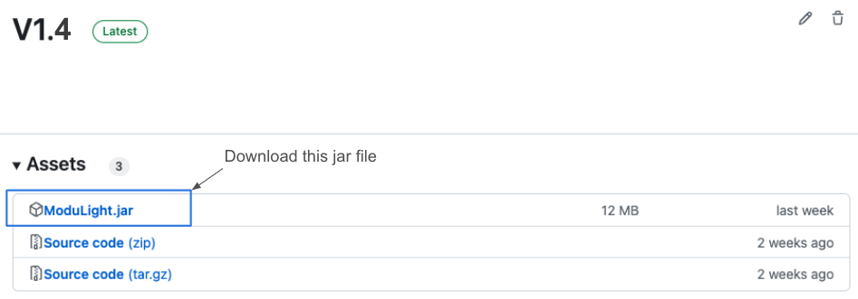
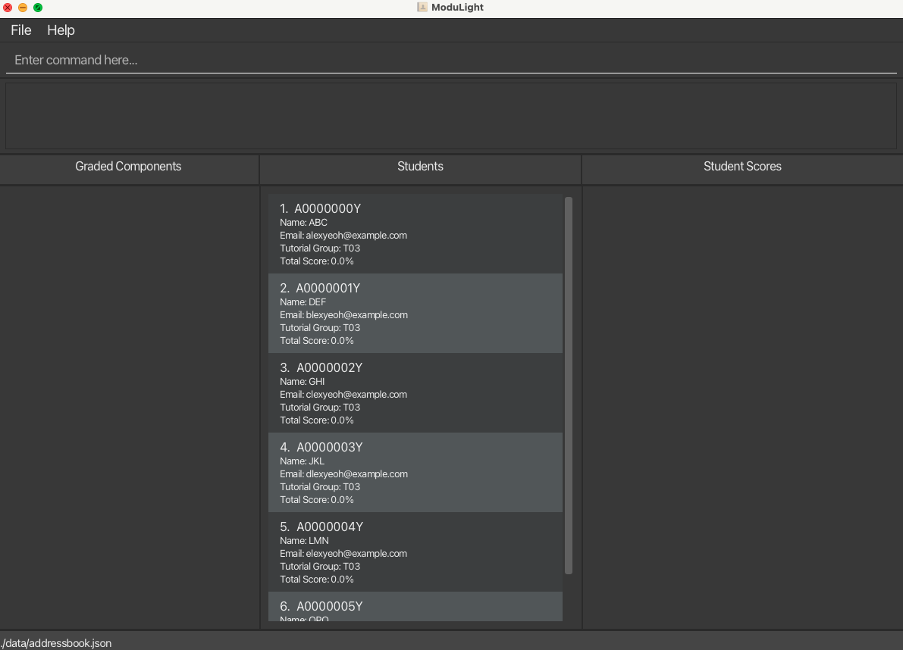
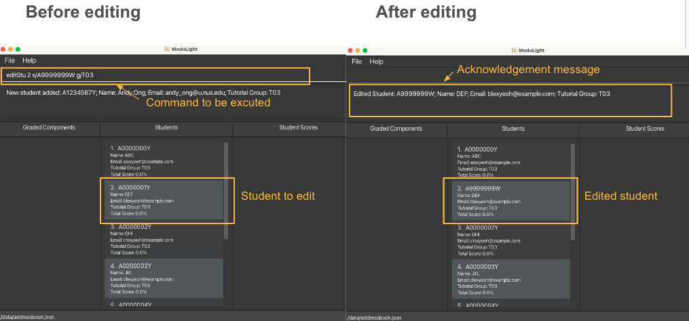
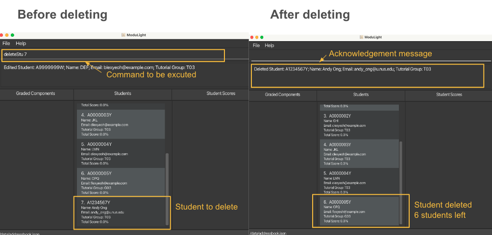
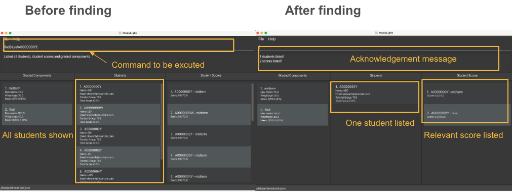
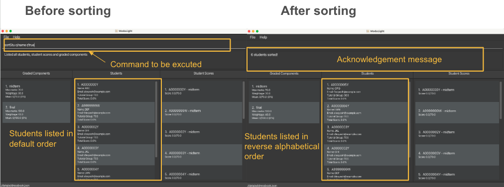
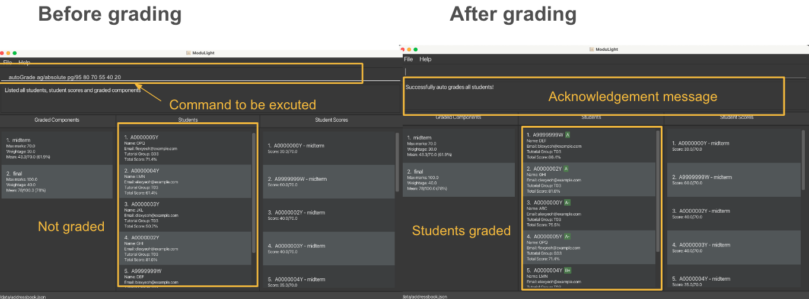
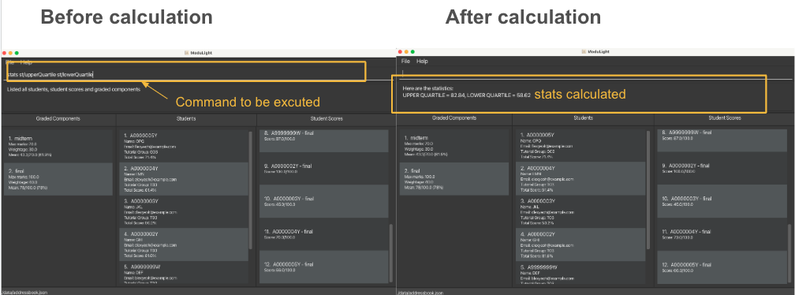

# User Guide: ModuLight

## Welcome to ModuLight

_**Min-max your module management!**_

ModuLight is a **desktop app** built for **professors from National University of Singapore from the School of Computing to manage students and 
assessments** for a single module. This app is ideally designed for professors with intermediate or higher technical knowledge,
who are comfortable using the Command Line Interface (CLI) and terminal. We also assume that the professors are already familiar with module structures,
such as the graded components and their weightages and the number of students and tutorial groups.

Here’s an overview of how ModuLight can help you to streamline your module management process:
* Store and edit information about your students and various assessments.
* Calculate statistics on cohort performance for assessments and autograde based on customised parameters.
* Track qualitative information about your students and assessments using tags and comments.

Furthermore, we believe that module management should be **efficient**. Therefore, ModuLight is **optimized for use 
via a [Command Line Interface](#glossary)** while still having the benefits of a [Graphical User Interface (GUI)](#glossary). For those proficient in typing, ModuLight can get your student grading tasks done faster than traditional GUI apps.

--------------------------------------------------------------------------------------------------------------------
* Table of Contents
  * **[How to use this guide](#how-to-use-this-guide)**
  * **[Quick Start](#quick-start)**
  * **[Parameter Information](#parameter-information)**
  * **[Navigating the Graphical User Interface (GUI)](#navigating-the-graphical-user-interface-gui)**
  * **[Command Format](#command-format)**
  * **[Features](#features)**
  * **[Command Summary](#command-summary)**
  * **[FAQ](#faq)**
  * **[Glossary](#glossary)**

## How to use this guide
1. For the first time users we recommend to:

   * Start with the [Quick start](#quick-start) to download, setup and run the program.
   
   * Go through [Navigating the Graphical User Interface (GUI)](#navigating-the-graphical-user-interface-gui) 
     section to understand the different components of the GUI of the program.
   
   * Go through the [Command Format](#command-format) to get an idea of the correct way to understand and input the 
     commands.
   
   * Look out for the following text box and text styles.
      * We use link such as [Command Summary Link](#command-summary) to direct you to a specific section in this guide. 
     
      * We also use text with background, such as `code` to highlight text relevant to commands.
      * We use the following box to show important tips and alerts

**:information_source: Important alert**:
Important information that you should take note of

**:bulb: Useful tips**:
Useful tips and additional information that helps you to make better use of ModuLight

   
2. For regular users:

   * We have provided a [command summary](#command-summary) for you to check all the available features.
   
   * More detailed explanation of the features can be found under the [Features](#features) section.
   * An overview of all the parameters used in the commands along with their constraints and such  can be found 
     under the [Parameter Information](#parameter-information) section.

## Quick start

1. Ensure you have Java `11` or above installed in your Computer. If you are unsure about how to verify your java version, you can refer to the [FAQ](#faq) section.

2. Download the latest `ModuLight.jar` from [here](https://github.com/AY2324S1-CS2103T-W08-2/tp/releases).
   

3. Copy the file to the folder you want to use as the _home folder_ for your ModuLight.

4. Open a [command terminal](#glossary). Type `cd` and press enter to move into the folder you put the jar file in, and use the `java -jar ModuLight.jar` 
   command to run the application. If you are unsure about how to open a terminal, please refer to the [FAQ](#faq) section.   
   A GUI similar to the below should appear in a few seconds. Note how the app contains some sample data. 

   

5. Type the command in the [command box](#navigating-the-graphical-user-interface-gui) and press Enter to execute it. e.g. typing **`help`** and pressing Enter will open the help window. 
   Some example commands you can try:

   * `addStu s/A1234567X e/e0725856@u.nus.edu g/T02 n/Jamus Lim` : Adds a Student named Jamus Lim.

   * `addComp c/Midterm Exam w/25 mm/75` : Adds a Graded Component named Midterm Exam.

   * `editScore 1 m/10` : Edits the score of the Midterm Component for the student with the student id A1234567X.

6. Refer to the [Features](#features) below for details of each command.

## Parameter Information

ModuLight keeps track of a lists of students, a list of student scores and a list of graded components. 
   * A student contains the basic personal information of a student, such as student id, email and tutorial group.
   * A graded component is an assignment or assessment, for example a research report or midterm. It has a maximum mark and a weightage.
   * A student score is a score that a student obtained for a particular graded component. 

The following section gives an overview of the parameters used for the commands related to student, student score and graded component, as well as the constraints of these parameters.

### Student Parameters

| Parameter | Description                   | Constraints                                                                | Valid Examples                                         | Invalid Examples           |
|-----------|-------------------------------|----------------------------------------------------------------------------|--------------------------------------------------------|----------------------------|
| n/        | Name of the student           | Must only contain alphanumeric characters and must not be empty.           | John, Lee Xiao Ming                                    | 晓明, Xiao Ming@Lee, 이준      | 
| e/        | Email of the student          | Must consist of an alphanumeric prefix, @ symbol and a [domain](#glossary) | 12@gmail.com, e123@u.nus.edu | 12@, 1234gmail             |
| s/        | Student ID of the student     | Must begin and end with a capital letter and have 7 digits in between them | A1234567W                                              | a1234567w, a123w, B1234567 |
| g/        | Tutorial group of the student | Must consist of a capital letter followed by 2 digits                      | T06, L10                                               | T1, t10, T111, @T11        |
| t/        | Tag of the student            | Must only contain alphanumeric characters                                  | Potential TA, MakeupExam                               | 晓明, Xiao Ming@Lee, 이준      |

### Graded Component Parameters

| Parameter | Description                                               | Constraints                                                                   | Valid Examples      | Invalid Examples             |
|-----------|-----------------------------------------------------------|-------------------------------------------------------------------------------|---------------------|------------------------------|
| c/        | Name of the graded component                              | Must only contain alphanumeric characters and must not be empty               | Midterm Exam, CA2   | 高考, CA2/Oral, Practical-Exam |
| w/        | Weightage of the graded component                         | Must be a non-negative number, including decimals, less than or equal to 100. | 0, 0.25, 20         | -0.3, 1/2, (20), 1000.8, NIL |
| mm/       | Maximum marks for the graded component, in absolute terms | Must be a non-negative number less than or equal to 10000.                    | 0.0, 28, 100, 200.0 | -0.3, 1/2, (20), NIL         |

### Student Score Parameters

| Parameter | Description                                        | Constraints                                                                                                                                  | Valid Examples             | Invalid Examples           |
|-----------|----------------------------------------------------|----------------------------------------------------------------------------------------------------------------------------------------------|----------------------------|----------------------------|
| m/        | Marks of the Student Score, in absolute terms      | Must be a non-negative number, though decimals are allowed. Cannot exceed the maximum marks of the graded component this score is related to | 0, 0.23, 30.00, 20         | -1, ⅔, 2^3, twelve         |
| x/        | Comments of the student score                      | Must only contain alphanumeric characters                                                                                                    | Nice work!, Check number 2 | 好的                         |
| t/        | Tags of the student score                          | Must only contain alphanumeric characters                                                                                                    | Highest Score, Makeup Exam | @plagiarism, Highest_Score |

### Command Related Parameters

| Parameter | Description                                                                                                                                                                                       | Constraints                                                                                                                                                                                                                    | Valid Examples                                   | Invalid Examples            |
|-----------|---------------------------------------------------------------------------------------------------------------------------------------------------------------------------------------------------|--------------------------------------------------------------------------------------------------------------------------------------------------------------------------------------------------------------------------------|--------------------------------------------------|-----------------------------|
| INDEX     | Used in [edit commands](#edit-commands) and [delete commands](#delete-commands), The [index](#glossary) of the target student, score or component                                                 | Positive integer                                                                                                                                                                                                               | 1, 10, 21                                        | -2, 0                       |
| o/        | Used in the [sortStu](#sorting-students-sortstu) command, the selected parameter of students to be sorted                                                                                         | Only parameters in the list (The full list can be found under the description of [sortStu](#sorting-students-sortstu) command) are allowed                                                                                     | n, totalscore, tut                               | studentName, overall score  |
| r/        | Used in the [sortStu](#sorting-students-sortstu) and [sortStuScore](#sorting-students-scores-sortscore) commands, the reverse order (to arrange the list either in ascending or descending order) | Only parameters in the list (The full list can be found under the description of [sortStu](#sorting-students-sortstu) and [sortScore](#sorting-students-scores-sortscore) commands) are allowed                                | t, f, decreasing                                 | True, ascending             |
| st/       | Used in the [stats](#calculating-overall-statistics-stats) and [compStats](#calculating-statistics-of-a-graded-component-compstats) commands, the statistical measures to be calculated           | Only parameters in the list (The full list can be found under the description of [stats](#calculating-overall-statistics-stats) and [compStats](#calculating-statistics-of-a-graded-component-compstats) commands) are allowed | max, upperQuartile                               | quartile, correlation       |
| pg/       | Used in [autoGrade](#auto-grading-all-the-students-autograde) to determine the passing value of the grade                                                                                         | At most 11 number, with each of them must be an integer. Furthermore, the value must be decreasing and cannot exceed 100 or below 0                                                                                            | 90 80 50 30 20, 0, 100                           | 101, -2, 90 70 75, 90 90 90 |                    |                            |
| ag/       | Used in [autoGrade](#auto-grading-all-the-students-autograde) to determine the grading method                                                                                                     | One of the: p, percentile, Percentile, a, absolute, Absolute                                                                                                                                                                   | p, percentile, Percentile, a, absolute, Absolute | Asolut, persentil           |

**Graded Component and Student Score parameters for score calculation**

* The maximum marks of a graded component and marks of a student score are both **absolute values** and are used together to
  determine the relative performance of a student for a component.   
   * For instance, if the maximum marks for a component `Midterms` is 50, and the marks for the student is 35, then the student scored 35/50 =70% on this graded component.
* The weightage of a graded component is used to determine its contribution to a student’s overall score, and is calculated
  **relative to the sum of all other component weightages**.   
   * For example, in a system with only 2 components, if component A has a weightage of 30 and component B has a weightage of 20, then component A represents 20/(20+30) = 60% of the student’s overall score. This changes as components are added or removed.
    Note that the **total weightage of all graded components should not exceed 100**.

**:bulb: Useful tips**:
> * If a graded component has a maximum mark of 0, the relative score for any associated student scores will be 0.
> * If a student or graded component has no associated student scores, the overall score will be listed as 0.

## Navigating the Graphical User Interface (GUI)

ModuLight comes with a GUI to allow for nice visual feedback for our users. Here is a quick run through of the different sections of our GUI, as well as some notes regarding the use of the GUI.

### Quick Orientation:

Here is a summary of each GUI component within ModuLight.

| Name of Component     | Description                                                                                                                                                                |
|-----------------------|----------------------------------------------------------------------------------------------------------------------------------------------------------------------------|
| Menu Bar              | Contains dropdown menu options for the App                                                                                                                                 |
| Command Box           | Allow users to enter their commands                                                                                                                                        |
| Result Display        | Provides feedback upon a user command. Allows users to see if their command was successful or not. Provides error messages to guide user on how to use ModuLight Commands. |
| Graded Component List | Shows a list of Graded Component Cards. This list can be manipulated through commands. Upon starting the app, this list will reflect all Graded Components stored.         |
| Graded Component Card | Displays key information about a Graded Component such as maximum marks and weightage.                                                                                     |
| Student List          | Shows a list of Student Cards. This list can be manipulated through commands. Upon starting the app, this list will reflect all Students stored.                           |
| Student Card          | Displays key information about a Student such as name, tutorial group, email, id, etc.                                                                                     |
| Student Score List    | Shows a list of Student Score Cards. This list can be manipulated through commands. Upon starting the app, this list will reflect all StudentsScores stored.               |
| Student Score Card    | Displays key information about student scores such as graded component name for which the student is given the score and the student score itself.                         |

## Command Format

| Notes                                                                                                                                | Explanation                                                                  | Examples                                                                                                                   |
|--------------------------------------------------------------------------------------------------------------------------------------|------------------------------------------------------------------------------|----------------------------------------------------------------------------------------------------------------------------|
| Words in UPPER_CASE                                                                                                                  | These are parameters that are supplied by the user                           | `addStu s/STUDENT_NO n/NAME…` can be used as `addStu s/A1234567Z n/John…`                                                  |
| Items in square brackets                                                                                                             | These are optional parameters (can be left empty by the user)                | `editScore 1 m/MARKS [x/COMMENTS]` can be used as `editScore 1 m/75` or `editScore 1 m/75 x/Great work.`                   |
| Items with ... after them                                                                                                            | These are parameters that can be used multiple times (or omitted completely) | `editStu INDEX [t/TAG...]` can be used as `editStu 1 t/plagiarism t/withdraw` or `editStu 1 t/plagiarism`                  |
| Parameters can be in any order                                                                                                       | NIL                                                                          | `editStu 1 n/megan t/T00` is equivalent to `editStu 1 t/T00 n/megan`                                                       |
| If a parameter is expected only once and entered multiple times, an error message will be shown                                      | NIL                                                                          | `editStu 1 n/megan n/maegan` results in error message `Multiple values specified for the following single-valued field(s)` |
| Extraneous parameters for commands that do not take in parameters (such as `help`, `exit` , `listAll` and `clearAll` will be ignored | NIL                                                                          | `help abc` is equivalent to `help`                                                                                         |

## Features

**:information_source: Important alert**:
If you are using a PDF version of this document, be careful when copying and pasting commands that span multiple lines as space characters surrounding line-breaks may be omitted when copied over to the application.  

## Add Commands
You can use the following commands to add a new student or graded component. 

**:bulb: Useful tips**:
Student scores will be automatically added when a new student or component is added.

### Add a student: `addStu`
You can use this command to add a student to the database so that you can track all students taking the course.  
Throws error if student with same student number already exists. If successful, an acknowledgement message is shown and data is saved. Otherwise, an error message is shown instead.

Format: `addStu s/STUDENT_NO n/NAME e/EMAIL [g/TUTORIAL_GRP] [t/tags…]`

* Valid student numbers start and end with an upper-case alphabet, and have 7 numeric symbols in between.
* it is allowed to omit the tutorial group. In this case, the student's tutorial group will be T00 by default.

Examples: 
* `addStu s/A1234567Y n/Andy Ong g/T03 e/andy_ong@u.nus.edu` Adds a student with student number A1234567Y, name Andy Ong, with email andy_ong@u.nus.edu belonging to tutorial group T03 to the database.

### Add a graded component: `addComp`
You can use this command to add a graded component to the database so that you can track all graded components in my course thus far.  
If successful, an acknowledgement message will be shown in the output box and data is saved. Otherwise, a failure message is shown instead specifying the cause of failure.

Upon successful creation of a graded component, a corresponding student score will be created for each student in the database. For instance, if a graded component with name “Midterms” is created and there are two students with student numbers `A1234567X` and `A1234567Y` in the database, then two student scores are created with titles `A1234567X - Midterm` and `A1234567Y - Midterm`.

* When adding the component, you must ensure that the total weightage of all components does not exceed 100.
* Weightage is a relative value calculated relative to the sum of all other weightage values. For more details, view [the notes on score calculations](#command-related-parameters).
* Please refrain from entering numbers with more than 2 decimal places of precision.

Format: `addComp c/COMP_NAME w/WEIGHTAGE mm/MAX_MARKS`

Examples: `addComp c/Midterm w/30 mm/70`  adds a graded component called “Midterm” with a weightage of 30 and a maximum mark of 70.

## Edit Commands

You can use the following commands to edit a student, student score or graded component.

**:bulb: Useful tips**:
A student score is related to a student and a graded component. Thus, when one entity is edited, its information in all related entities will be edited as well.
For instance, when a student's student ID is edited, the change will be reflected in all scores that belong to this student.

### Edit a student : `editStu`
You can use this command to edit an existing student’s details in the database so that you can update outdated student information or correct mistakes, based on the 1-based index of the student shown in the currently visible Student list.  
If successful, an acknowledgement message will be shown in the result display and data is saved. Otherwise, a failure message is shown instead specifying the cause of failure.

Format: `editStu INDEX [s/STUDENT_NO] [g/TUTORIAL_GRP] [n/NAME] [e/EMAIL] [t/tags…]​`

* 1 or more fields to be edited must be provided in the command.
* The index provided must be more than 0 and not exceed the number of students displayed in the Student list.
* If the student number is being edited, the edited student number must be different from any other student already in the database.**

Examples:
* `editStu 2 s/A9999999W g/T03` edits the second student in the Student list to have student number A9999999W, and have tutorial group T03.

### Edit a graded component: `editComp`
You can use this command to edit an existing graded component’s details in the database so that you can make changes to a component (e.g. modify weightage) or correct mistakes, based on the 1-based index of the graded component shown in the Graded Components list.  
If successful, an acknowledgement message will be shown in the output box and data is saved. Otherwise, a failure message is shown instead specifying the cause of failure.

* 1 or more fields to be edited must be provided in the command. 
* The index provided must be more than 0 and not exceed the number of graded components displayed in the Graded Components list. 
* If the component name is being edited, the component name cannot match the component name of any other graded component already in the database.
* When editing the component, you must ensure that the total weightage of all components does not exceed 100.
* If editing the maximum marks, ensure none of the current student scores exceed the new maximum marks.
* Weightage is a relative value calculated relative to the sum of all other weightage values. For more details, view [the notes on score calculations](#command-related-parameters).
* Please refrain from entering numbers with more than 2 decimal places of precision.

Format: `editComp INDEX [c/COMP_NAME] [w/WEIGHTAGE] [mm/MAX_MARKS]`

* if no parameters except index are passed in, it will throw an error.

Examples: `editComp 4 c/Midterm Exam mm/55` edits the fourth graded component in the Graded Components list to have a name of “Midterm Exam”, and a maximum mark of 55.

### Edit student score: `editScore`

You can use this command to edit a student’s mark for a certain graded component so that you can regrade student scripts or correct mistakes, based on the 1-based index of the student score shown in the Student Scores list.

Note: a StudentScore will be automatically added when a graded component is created or when a new student is added. Similarly, student scores will be automatically deleted when its associated graded component or student is deleted.

* 1 or more fields to be edited must be provided in the command.
* The index provided must be more than 0 and not exceed the number of student scores displayed in the Student Scores list.
* The mark given cannot exceed the maximum marks for the associated graded component.
* Please refrain from entering numbers with more than 2 decimal places of precision.

Format: `editScore INDEX [m/SCORE] [x/comment] [t/tags]`

* if the mark is being edited, the new mark should be more than 0 and not exceed the associated component's maximum marks.
* if no parameters except index are passed in, it will throw an error.

Examples: `editScore 7 m/57` assigns a mark of 57 for the seventh student score in the Student Scores list.

## Delete Commands
You can use the following commands to delete a student or graded component from the database.

**:bulb: Useful tips**:
Student scores will be automatically deleted when the corresponding student or component is deleted.
For instance, when a student is deleted, all scores that belong to this student will be deleted. They will be deleted from the graded components as well.

### Delete a student : `deleteStu`
You can use this command to delete an existing student in the database so that you can remove students dropping the course/wrongly assigned, based on the 1-based index of the student shown in the currently visible Student list.  
If successful, an acknowledgement message will be shown in the output box and data is saved. Otherwise, a failure message is shown instead specifying the cause of failure.

Format: `deleteStu INDEX`

* The index provided must be at least 1 and not exceed the number of students displayed in the Student list.

Examples:
* `deleteStu 7` deletes the seventh student in the currently visible Student list.

### Delete a graded component: `deleteComp`

You can use this command to delete an existing graded component in the database so that you can remove a graded component when it is deemed unnecessary, based on the 1-based index of the graded component shown in the displayed Graded Components list.  
If successful, an acknowledgement message will be shown in the output box and data is saved. Otherwise, a failure message is shown instead specifying the cause of failure.

Format: `deleteComp INDEX`

* The index provided must be more than 0 and not exceed the number of graded components displayed in the Graded Components list.

Examples: `deleteComp 2` deletes the second graded component in the displayed Graded Components List

## Find Commands

You can use the following commands to filter and show the interested students.

### Parameters

| Parameter | Relevant Commands   | Description                   | Match Criteria                                 | Search word | Match examples         | 
|-----------|---------------------|-------------------------------|------------------------------------------------|-------------|------------------------|
| n/        | findStu, findScore  | Name of the student           | If student name contains the search keywords   | John        | john, John Snow        | 
| e/        | findStu, findScore  | Email of the student          | If student email contains the search keywords  | @gmail.com  | 1234@.COM | 
| s/        | findStu, findScore  | Student ID of the student     | If student ID contains the search keywords     | a12345      | A1234567W, A1234568W   | 
| g/        | findStu, findScore  | Tutorial group of the student | Exact match                                    | t08         | T08                    |
| t/        | findStu, findScore  | Tag of the student            | Exact match                                    | ta          | TA                     | 
| x/        | findScore           | Comment of the student score  | If the comment contains the search key words   | plagiarism  | Potential plagiarism   | 
 | c/        | findComp, finsScore | Name of the graded components | If component name contains the search keywords | midterm     | Midterm                |

* All find parameters are case-insensitive, except for tag which needs an exact match
* It is allowed to have 0 searching criteria. In this case, this command will simply list all objects.
* For searching with multiple parameters of the same type, it will find the objects which satisfy any of the
   criteria.
* For searching with parameters of different types, it will find the objects which satisfy all the criteria.
* For searching with multiple parameters of different types, it will find the objects which satisfy at least one
   criterion for each type.

**:bulb: Useful tips**:
* If a student number of the incorrect format is given, there might be no entity found. For example, if you search findStu
   s/A00000Y, no students will be found since this is not a substring of any valid student number. 
* If you would like to see the complete lists again, please use the [`listAll` command](#list-all-listall).

### Find students: `findStu`

You can use this command to shows all students who match the given search keyword of the specific parameter. 
All the relevant student scores will be displayed as well so that you can quickly find information about a student and their scores without having to search through the list. All graded components will be displayed as they are relevant.

Format: `findStu [s/STUDENT_NO...] [n/NAME...] [e/EMAIL...] [g/TUTORIAL_GRP...] [t/TAG...]`

Examples:
* `findStu s/A000000Y` returns the data of the student whose student ID is A0000000Y.

### Find graded components : `findComp`
You can use this command to show all graded components who match the given search keyword of the specific parameter. All the relevant student scores and 
all students will be displayed as well so that you can quickly find information about a graded component and the scores without having to search through the list.

Format: `findComp [c/COMP_NAME]`

Example: `findComp c/midterm` lists all graded components containing the string midterm  (and their associated scores). 
All students will be shown since they are relevant.

### Find student scores : `findScore`
You can use this command to show all student scores that matches the given search keyword of the specific parameter so that you can quickly find information about a student score without having to search through the list. No student or graded components will be displayed.
Format: `findScore  [s/STUDENT_NO...] [n/NAME...] [e/EMAIL...] [g/TUTORIAL_GRP...] [c/COMP_NAME...][x/comments...][t/tags...]`

Example: `findScore g/T02 c/midterm` lists all midterm scores in tutorial group T02. The graded component and student list will be emptied.

## Sort Commands
You can use the following commands to sort the students or student scores by a given criteria.

### Sorting students: `sortStu`

You can use this command to sort student data by the given criteria so that you can find the top students easily.

Format: `sortStu [o/SORTING_ORDER] [r/REVERSE_ORDER]`

* The sorting order keyword must be one of the acceptable description provided below:  

| Accepted keywords                  | Field to be sorted | Description                                         |
|------------------------------------|--------------------|-----------------------------------------------------|
| `n`, `name`                        | `n/`               | Name of the student by alphabetical order           |
| `s`, `studentId`, `studentID`      | `s/`               | Student ID of the student by alphabetical order     |
| `e`, `email`                       | `e/`               | Email of the student by alphabetical order          |
| `g`, `tutorial`, `tut`, `tutGroup` | `g/`               | Tutorial group of the student by alphabetical order |
| `ts`, `totalScore`, `score`        | NIL                | Total score of the student by numerical value       |

* The reverse order keyword must be one of the acceptable description given below:  
"decreasing", "0", "false", "f" (These 4 keywords have the same effect), "increasing", "1", "true", "t" (These 4 
keywords have the same effect).
* It is allowed to omit sorting order and reverse order. In this case, the default sorting order is by total score while 
the default reverse order is false (i.e. increasing).
* This command sorts only the currently displayed students. To sort all students, please use `listStu`
command in advance. If there is no currently displayed student, the command can still execute successfully, but the list of
students will remain unchanged.

Examples:
* `sortStu o/name r/true` displays the students sorted in descending alphabetical order by their names.

### Sorting students scores: `sortScore`

You can use this command to sort students score by the given criteria and display its associated students in order so that you can find the top students with their associated scores easily .

Format: `sortScore c/COMP_NAME [r/REVERSE_ORDER]`

* The reverse order keyword must be one of the acceptable description given below:  
  "decreasing", "0", "false", "f" (These 4 keywords have the same effect), "increasing", "1", "true", "t" (These 4
  keywords have the same effect).
* It is allowed to omit reverse order. In this case, the default reverse order is false (i.e. increasing).
* This command will only sort the currently displayed students. If you want to sort all students, please use `listAll`
  command in advance. If there is no currently displayed student, the command can still execute successfully, but the lists of
  students and student scores will remain unchanged.

Examples:
* `sortScore c/Midterm r/true` returns the sorted students whose midterm scores are in descending order.

## Statistics and Auto Grading Commands
### Auto grading all the students: `autoGrade`

You can use this command to automatically assigns grades to all students based on their total score and
the automatic grading method so that you can significantly reduce the time needed to grade the students and avoid manually grading each student.

Format: `autoGrade ag/METHOD pg/PASSING_VALUE`
 
There are 2 possible `METHOD`:
  * Percentile Method: `p`, `percentile`, `Percentile`
    * Calculate students' grade based on the statistical percentile.
  * Absolute Score Method: `a`, `absolute`, `Absolute`
    * Calculate students' grade based on the given passing grade values.
    * the absolute value is compared directly with the students' total score (in percentage of the maximum score possible).

The `PASSING_VALUE` are numbers that determine the boundary for each grade
  * The structure of `PASSING_VALUE`: `[A+] [A] [A-] [B+] [B] [B-] [C+] [C] [D+] [D] [F]`
  * Each bracket represents the boundary value for the grade.
    * For `percentile` method, it is the statistical percentile value.
    * For `absolute` method, it is the total score.
  * It is **not** compulsory to fill all the `PASSING_VALUE`, but such approach would make students below the lowest given passing value to be graded `F`. 
  * Example: `pg/90 80 65 40 30`. This would correspond to:
    * Value `90` given to `A+`
    * Value `80` given to `A`
    * Value `65` given to `A-`
    * Value `40` given to `B+`
    * Value `30` given to `B`
    * Any Value below `30` will be given `F`

**:bulb: Useful tips**:
The `autoGrade` command works on the filtered student list. This would allow for example, to grade students only compared to their own tutorial group. To automatically grade every student in the module, please use `findStu` command to display every student.

Example:
* `autoGrade ag/absolute pg/95 80 70 55 40 20`. This would automatically grade student by using absolute grade threshold. Student with total score `95%` above will be given `A+`, total score below `95%` and `90` above will be given `A`, and so on, while below `20%` will be given `F`.

### Calculating overall statistics: `stats`

You can use this command to calculate overall statistics of all students so that you can have a quick insight of how your students are performing.

Format: `stats [st/STATS] [g/TUTORIAL_GRP]`

* It is allowed to omit `[st/STATS]`. In this case, it will return a summary of all currently supported statistics.
* For stats keywords, it must be currently supported. Here is an exhaustive list of currently supported statistical
measures: `mean`, `standardDeviation`, `upperQuartile`, `lowerQuartile`, `max`, `min`, `skewness`.
* For the calculation of upper and lower quartile, we use Method 4 introduced in [Wikipedia](https://en.wikipedia.org/wiki/Quartile).
* If there is only valid score matching the criteria, skewness will be displayed as `NaN` because skewness for one data
is meaningless.
* Multiple stats keywords are allowed, but only 0 or 1 tutorial group keyword is allowed.

Examples:
* `stats st/upperQuartile st/lowerQuartile` returns the upper and lower quartile of the overall student grades.

### Calculating statistics of a graded component : `compStats` 

You can calculate statistics of all student scores of a specific graded component so that you can have a quick insight of how my students are performing in a specific assignment.

Format: `compStats c/COMP_NAME [st/STATS] [g/TUTORIAL_GRP]`

* It is allowed to omit `[st/STATS]`. In this case, it will return a summary of all statistics that are currently
  supported.
* For stats keywords, it must be currently supported. Here is an exhaustive list of currently supported statistical
  measures: `mean`, `standardDeviation`, `upperQuartile`, `lowerQuartile`, `max`, `min`, `skewness`.
* For the calculation of upper and lower quartile, we use Method 4 introduced 
in [Wikipedia](https://en.wikipedia.org/wiki/Quartile).
* If there is only valid score matching the criteria, skewness will be displayed as `NaN` because skewness for one data
is meaningless.
* Multiple stats keywords are allowed, but only 0 or 1 tutorial group keyword is allowed.

Examples:
* `compStats st/upperQuartile st/lowerQuartile c/Midterm` returns the upper and lower quartile of the 
student grades in Midterm.

## Other Commands
### Viewing help : `help`

You can use this command to show a message explaining how to access the help page.

Format: `help`

### List all : `listAll`
You can use this command to show all students, student scores and graded components in their lists respectively. This removes all the filter applied from the find command.

Format: `listAll`

Example: `listAll`

### Clearing all entries : `clearAll`

You can use this command to clear all data from ModuLight.

Format: `clearAll`

* The clearing process is irreversible.

### Exiting the program : `exit`

You can use this command to exit the program.

Format: `exit`

### Saving the data

ModuLight data is saved in the hard disk automatically after any command that changes the data. There is no need for you to save manually.

### Loading the previous data

There is no need to manually load data stored on the hard disc. It will be available automatically everytime the program starts.

## Command summary

| Action                                              | Format, Examples                                                                                                                      |
|-----------------------------------------------------|---------------------------------------------------------------------------------------------------------------------------------------|
| **Add a student**                                   | `addStu s/STUDENT_NO n/NAME e/EMAIL [g/TUTORIAL_GRP] [t/tags…]`   e.g., `addStu s/A1234567Y n/Andy Ong g/T03 e/andy_ong@u.nus.edu` |
| **Add a graded component**                          | `addComp c/COMP_NAME w/WEIGHTAGE mm/MAX_MARKS`   e.g., `addComp c/Midterm w/30 mm/70`                                              |
| **Edit a student**                                  | `editStu INDEX [s/STUDENT_NO] [g/TUTORIAL_GRP] [n/NAME] [e/EMAIL] [t/tags…]​`   e.g., `editStu 1 s/A1234567Y g/T03`                |
| **Edit a graded component**                         | `editComp INDEX [c/COMP_NAME] [w/WEIGHTAGE] [mm/MAX_MARKS]`   e.g., `editComp 1 c/Midterms mm/55`                                  |
| **Edit a student score**                            | `editScore INDEX [m/SCORE] [x/comment]`   e.g., `editScore 1 m/57`                                                                 |
| **Delete a student**                                | `deleteStu INDEX`   e.g., `deleteStu 2`                                                                                            |
| **Delete a graded component**                       | `deleteComp INDEX`   e.g., `deleteComp 1`                                                                                          |
| **Delete everything**                               | `clearAll`                                                                                                                            |
| **Find a student**                                  | `findStu [s/STUDENT_NO...] [n/NAME...] [e/EMAIL...] [g/TUTORIAL_GRP...] [t/TAG...]`  e.g., `findStu n/Alice n/Bob g/T01`           |
| **Find a graded component**                         | `findComp [c/COMP_NAME]`  e.g., `findComp c/Midterms`                                                                              |
| **Find a student score**                            | `findScore  [s/STUDENT_NO] [n/NAME] [e/EMAIL] [g/TUTORIAL_GRP] [c/COMP_NAME][x/comments][t/tags]...`  e.g., `findScore c/Midterms` |
| **List all students, scores and graded components** | `listAll`                                                                                                                             |
| **Sort student**                                    | `sortStu [o/SORTING_ORDER] [r/REVERSE_ORDER]`   e.g., `sortStu o/name r/true`                                                      |
| **Sort student score**                              | `sortScore [o/SORTING_ORDER] [r/REVERSE_ORDER]`   e.g., `sortScore o/name r/true`                                                  |
| **Auto grading all the students**                   | `autoGrade ag/METHOD pg/PASING_VALUE`   e.g., `autoGrade ag/absolute pg/95 80 70 55 40 20`                                         |
| **Calculate overall statistics**                    | `stats [st/STATS] [g/TUTORIAL_GRP]`   e.g., `stats st/upperQuartile st/lowerQuartile g/T01`                                        |
| **Calculate component statistics**                  | `compStats [c/COMP_NAME] [st/STATS] [g/TUTORIAL_GRP]`   e.g., `compStats c/midterm st/upperQuartile st/lowerQuartile`              |
| **Help**                                            | `help`                                                                                                                                |

## FAQ
1. **Q**: How do I transfer my data to another Computer? 
   **A**: You can install the app in the other computer and overwrite the empty data file it creates with the file that contains the data of your previous ModuLight home folder.

2. **Q**: How does the calculation of scores work? 
   **A**: You may refer to the [notes on score calculations](#command-related-parameters).

3. **Q**: Does the display update information (e.g. name, mean) in real time? 
   **A**: Yes.

4. **Q**: Why should I avoid entering numbers with more than 2 decimal places of precision? 
   **A**: Numerical errors have been known to occur due to the limits of floating-point precision on computers.

5. **Q**: What should I do if the application GUI opens off-screen when switching from multiple screens to a single screen? 
   **A**: If you move the application to a secondary screen and later switch to using only the primary screen, the GUI may open off-screen. To resolve this issue, delete the `preferences.json` file created by the application before running it again. This ensures that the GUI is properly displayed on the primary screen.

6. **Q**: How do I verify the java version installed in my computer?  
   **A**: You can open a terminal and enter "java -version". The java version installed will be displayed in the terminal window.

7. **Q**: How do I open a terminal? 
   **A**: It depends on the operating system.
   * **Mac**: Open launchpad and search for terminal. Click the app icon to open terminal.
   * **Windows**: In Windows Search, search for terminal and select Windows Terminal from the search results.

## Glossary

### Definitions

| Term                     | Definition                                                                                                                                                                                            |
|--------------------------|-------------------------------------------------------------------------------------------------------------------------------------------------------------------------------------------------------|
| Alphanumeric             | A piece of alphanumeric text should consist of only alphabets and numeric values. For instance,  the text “ABC11” is alphanumeric whereas “(**)” is not.                                              |
| Command                  | An input written by the user to tell Modulight to perform a certain action.                                                                                                                           |
| Command Line Interface   | It is a text-based user interface that accepts text inputs to execute commands.                                                                                                                       |
| Command Terminal         | A text input and output environment that allows us to enter commands that the computer processes.                                                                                                     |
| Component                | A component is a part of the user interface.                                                                                                                                                          |
| Domain                   | A domain is a digital address of a website. For emails, domain is the web address that comes after the @ symbol. For example, the domain in the email address 123@gmail.com is gmail.com |
| Graphical User Interface | It is a digital interface where the users interact with the system using graphical components, such as icons and buttons.                                                                             |
| Index                    | A number that refers to the position of the components in an ordering. Modulight uses a 1-based index, which means the first number in an order is 1.                                                 |
| JSON file                | JavaScript Object Notation(JSON) is a file used for data storage in ModuLight. For more information, please refer to the guide [here](https://www.oracle.com/sg/database/what-is-json/).              |
| Parameter                | A value that must be inputted by the user to complete a command.                                                                                                                                      |
| User Interface           | It is the point in which a human user interacts with a computer. It can be a physical device or software program.                                                                                     |
