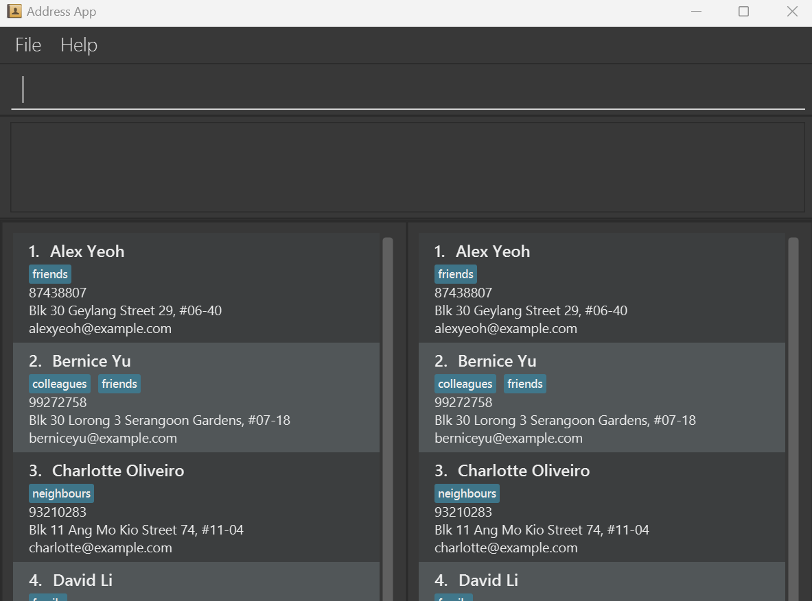

# LumiNUS User Guide

LumiNUS is a **desktop app for managing students' grades, optimized for use via a  Line Interface** (CLI) while still having the benefits of a Graphical User Interface (GUI). If you can type fast, LumiNUS can get your contact management tasks done faster than traditional GUI apps.

<!-- * Table of Contents -->
<page-nav-print />

--------------------------------------------------------------------------------------------------------------------

## Quick start

1. Ensure you have Java `11` or above installed in your Computer.

2. Download the latest `luminus.jar` from [here](https://github.com/se-edu/addressbook-level3/releases).

3. Copy the file to the folder you want to use as the _home folder_ for your AddressBook.

4. Open a command terminal, `cd` into the folder you put the jar file in, and use the `java -jar addressbook.jar` command to run the application. 
   A GUI similar to the below should appear in a few seconds. Note how the app contains some sample data. 
   

5. Type the command in the command box and press Enter to execute it. e.g. typing **`help`** and pressing Enter will open the help window. 
   Some example commands you can try:

   * `list` : Lists all contacts.

   * `add n/John Doe p/98765432 e/johnd@example.com a/John street, block 123, #01-01` : Adds a contact named `John Doe` to the Address Book.

   * `delete 3` : Deletes the 3rd contact shown in the current list.

   * `clear` : Deletes all contacts.

   * `exit` : Exits the app.

6. Refer to the [Features](#features) below for details of each command.

--------------------------------------------------------------------------------------------------------------------

## Features

<box type="info" seamless>

**Notes about the command format:** 

* Words in `UPPER_CASE` are the parameters to be supplied by the user. 
  e.g. in `add n/NAME`, `NAME` is a parameter which can be used as `add n/John Doe`.

* Items in square brackets are optional. 
  e.g `n/NAME [t/TAG]` can be used as `n/John Doe t/friend` or as `n/John Doe`.

* Items with `…`​ after them can be used multiple times including zero times. 
  e.g. `[t/TAG]…​` can be used as ` ` (i.e. 0 times), `t/friend`, `t/friend t/family` etc.

* Parameters can be in any order. 
  e.g. if the command specifies `n/NAME p/PHONE_NUMBER`, `p/PHONE_NUMBER n/NAME` is also acceptable.

* Extraneous parameters for commands that do not take in parameters (such as `help`, `list`, `exit` and `clear`) will be ignored. 
  e.g. if the command specifies `help 123`, it will be interpreted as `help`.

* If you are using a PDF version of this document, be careful when copying and pasting commands that span multiple lines as space characters surrounding line-breaks may be omitted when copied over to the application.
</box>

### Viewing help : `help`

Shows a message explaning how to access the help page.

Format: `help`

### Add a student: `addStu`
Adds a student to the database. Throws error if student with same student number already exists. If it succeeds, an acknowledgement message (“Student was added successfully”) is shown to the user and data is saved. If it fails, show an error message instead. (“Something went wrong while adding student”)
Valid student numbers start and end with an upper-case alphabet, and have 7 numeric symbols in between.

Format: `addStu s/STUDENT_NO [n/NAME] [e/EMAIL] [t/TUTORIAL_GRP]…​`

Examples:
* `addStu s/A1234567Y n/Andy t/03` Adds a student with student number A1234567Y, name Andy, belonging to tutorial group 03 to the database.

### Edit a student : `editStu`
Edit student information. If it succeeds, it shows an acknowledgement message and saves the edited information (“Student information edited successfully”). Throws an error if student does not exist (“Something went wrong while editing student information”). Note that the student number cannot be edited as it is a unique identifier. In such a case, the student should be deleted.
0 or more optional fields should be provided, and all the optional fields will be edited concurrently. Valid student numbers start and end with an upper-case alphabet, and have 7 numeric symbols in between.

Format: `editStu s/STUDENT_NO [t/TUTORIAL_GRP][n/NAME][e/EMAIL]…​`

Examples:
* `editStu n/Megan Chan t/03` Edits a student to have name Megan Chan and be in tutorial group 03.

### Delete a student : `deleteStu`
Delete a student in the database. If it succeeds, it shows an acknowledgement message and deletes the student from the database (“Student information deleted successfully”). Throws an error if student does not exist (“Something went wrong while deleting the student”). All associated student scores will also be deleted.
Valid student numbers start and end with an upper-case  alphabet, and have 7 numeric symbols in between.

Format: `deleteStu s/STUDENT_NO`

Examples:
* `deleteStu s/A1234567Y`

### Add a student score: `addStuScore`
Assign a student’s score for a certain graded component. Throws an error if the Student or the graded component does not exist, or the score provided is negative. If the score exceeds the maximum score, it will show up on the panel as such, but for internal calculations it will be treated as the maximum score. (This is for users to indicate bonus scores)
Valid student numbers start and end with an upper-case alphabet, and have 7 numeric symbols in between.

Format: `addStuScore s/STUDENT_NO c/COMP_NAME m/MARKS [x/comments]`

Examples: 
* `addStuScore s/A1234567Y c/Midterm m/57`
Assigns a score of 57 to the graded component Midterm for the student with student number A123567Y.

### Edit student score: `editStuScore`
Edit a student’s score or comments. Throws an error if student or graded component does not exist, or if scores is negative.  If it succeeds, it shows an acknowledgement message and saves the edited information, and throws an error otherwise.
0 or more optional fields need to be provided, and all the information will be edited concurrently.

Format: `editStuScore s/STUDENT_NO c/COMP_NAME [m/MARKS] [x/comments]`

Examples: 
* `editComp s/A1234567Y c/Midterm x/Q4 answer is debatable. Discuss in next staff meeting. associates the given comment to A1234567Y’s Midterm score.`
 Edits the comments of the student score.

### Delete student score: `deleteStuScore`
Delete a student score in the database. If it succeeds, it shows an acknowledgement message and deletes the student score from the database (“Student score deleted successfully”). Throws an error if student score does not exist (“Something went wrong while deleting the student”).
Valid student numbers start and end with an upper-case  alphabet, and have 7 numeric symbols in between.

Format: `deleteStuScore s/STUDENT_NO c/COMP_NAME`

Examples:
* `deleteStuScore s/A1234567Y c/Midterm`

### List all students : `listStudents`
Shows a list of all students and associated student scores in separate panels respectively. The lists may be additionally filtered by optional arguments tutorial group. (can have more than 1)

Format: `listStudents [t/TUTORIAL_GRP …]`

Examples:
* `listStudents t/02 03`

### Locating students by student ID: `find`

Retrieves a student's data based on his/her Student ID.

Format: `find KEYWORD [MORE_KEYWORDS]`

* The search is case-insensitive. e.g. `a0123456` will match `A0123456`
* Only the student ID is searched.

Examples:
* `find a0123456` returns the data (including the grades) of the student with student id `a0123456`

### Clearing all entries : `clear`

Clears all entries from the address book.

Format: `clear`

### Exiting the program : `exit`

Exits the program.

Format: `exit`

### Saving the data

ModuLight data are saved in the hard disk automatically after any command that changes the data. There is no need to save manually.

### Loading the previous data

There is no need to manually load data stored on the hard disc. It will be available automatically everytime the program starts.

### Editing the data file

ModuLight data are saved automatically as a JSON file `[JAR file location]/data/modulight.json`. Advanced users are welcome to update data directly by editing that data file.

<box type="warning" seamless>

**Caution:**
If your changes to the data file makes its format invalid, ModuLight will discard all data and start with an empty data file at the next run.  Hence, it is recommended to take a backup of the file before editing it.
</box>

### Archiving data files `[coming in v2.0]`

_Details coming soon ..._

--------------------------------------------------------------------------------------------------------------------

## FAQ

**Q**: How do I transfer my data to another Computer? 
**A**: Install the app in the other computer and overwrite the empty data file it creates with the file that contains the data of your previous LumiNUS home folder.

--------------------------------------------------------------------------------------------------------------------

## Known issues

1. **When using multiple screens**, if you move the application to a secondary screen, and later switch to using only the primary screen, the GUI will open off-screen. The remedy is to delete the `preferences.json` file created by the application before running the application again.

--------------------------------------------------------------------------------------------------------------------

## Command summary

| Action                         | Format, Examples                                                                                                                                                    |
|--------------------------------|---------------------------------------------------------------------------------------------------------------------------------------------------------------------|
| **Add a student**              | `addStu s/STUDENT_NO [n/NAME] [e/EMAIL] [t/TUTORIAL_GRP]…`   e.g., `addStu s/A1234567Y n/Andy t/03`                                                              |
| **Add a graded component**     | `addComp c/COMP_NAME w/WEIGHTAGE m/MAX_MARKS…`   e.g., `addComp c/Midterm w/30 m/70`                                                                             |
| **Add a student score**    | `addStuScore s/STUDENT_NO c/COMP_NAME m/MARKS [x/comments]…`   e.g., `addStuScore s/A1234567Y c/Midterm m/57 `                                                   |
| **Edit a student**             | `editStu s/STUDENT_NO [t/TUTORIAL_GRP][n/NAME][e/EMAIL]…​`   e.g., `editStu n/Megan Chan t/03`                                                                   |
| **Edit a graded component**    | `editComp c/COMP_NAME [w/WEIGHTAGE] [m/MAX_MARKS]`   e.g., `editComp c/Midterm  w/25 `                                                                           |
| **Edit a student score**       | `editStuScore s/STUDENT_NO c/COMP_NAME [m/MARKS] [x/comments]`   e.g., `editComp s/A1234567Y c/Midterm x/Q4 answer is debatable. Discuss in next staff meeting.` |
| **Delete a student**           | `deleteStu s/STUDENT_NO`   e.g., `deleteStu s/A1234567Y`                                                                                                         |
| **Delete a graded component**  | `deleteComp s/Optional Project`   e.g., `deleteComp s/Optional Project`                                                                                          |
| **Delete a student score**     | `deleteStuScore s/STUDENT_NO c/COMP_NAME`   e.g., `deleteStuScore s/A1234567Y c/Midterm`                                                                         |
| **Clear**                      | `clear`                                                                                                                                                             |
| **Find**                       | `find KEYWORD [MORE_KEYWORDS]`  e.g., `find James Jake`                                                                                                          |
| **List all students**          | ` listStudents [t/TUTORIAL_GRP …]`   e.g., `listStudents t/02 03`                                                                                                |
| **List all graded components** | ` listComps [c/COMP_NAME …]`   e.g., `listComps c/CA1 CA2`                                                                                                       |
| **Help**                       | `help`                                                                                                                                                              |
